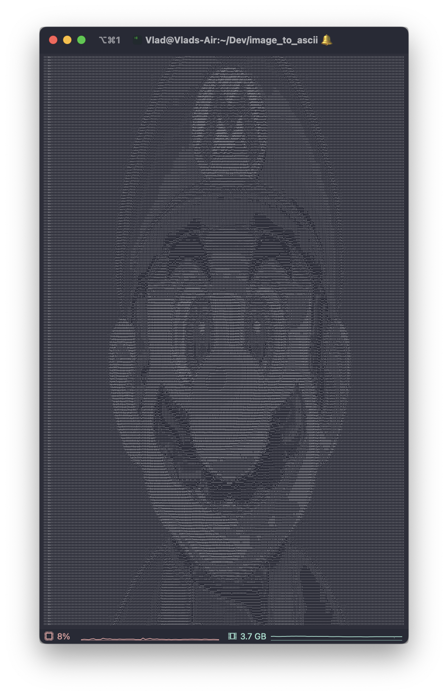

# Convert images to ASCII art using Python

**A simple script to convert your regular boring images to a badass ASCII art that you can view right from your terminal window (because why not?).**\
  

## Quickstart:
- Clone the project
- Install dependecies from `requirements.txt` (all you need is Pillow)
- Add your image of choice to the `media/` folder
- Copy and paste the name of the image which you would like to convert to ASCII art into the `image_name` variable of the `main.py` file
- Run the script `python main.py`
- Have fun